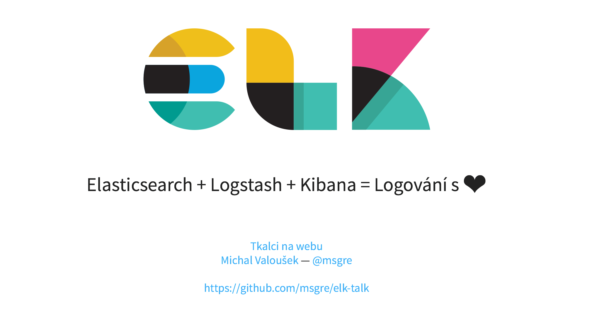

Materials for regular web development meetup 
[Tkalci na webu #36](http://tkalci.cz/2016/pozvanky/assertivni-sobi.html)
about ELK stack.

In directory [`talk`](talk/) you will find slides for my public lecture (they are also [online](http://tkalci.cz/srazy/36/elk/)). In
[`demo`](demo/) folder are complete installation instruction for launching
ELK stack in your environment.

