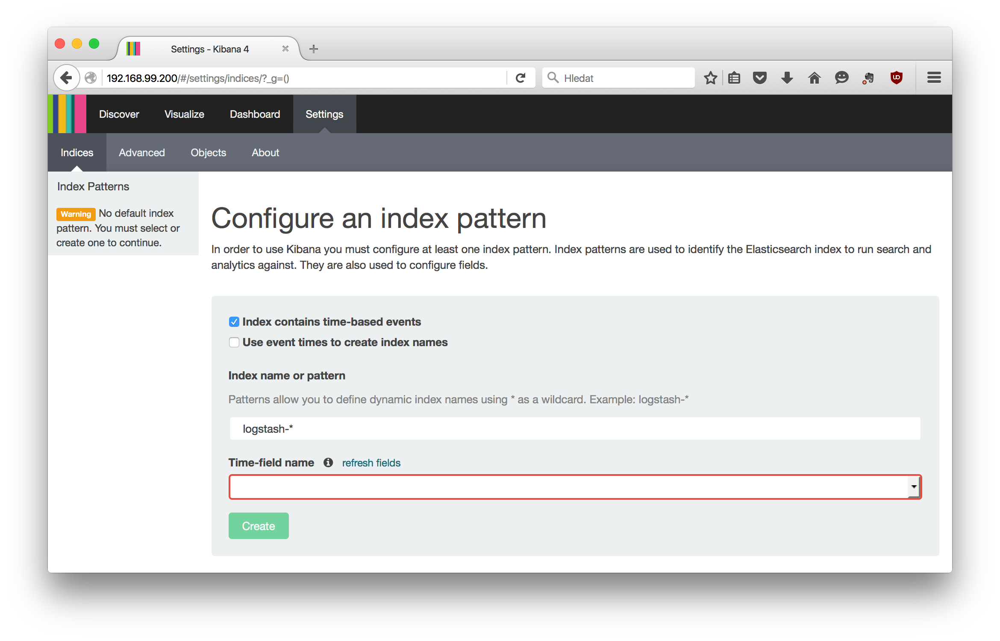
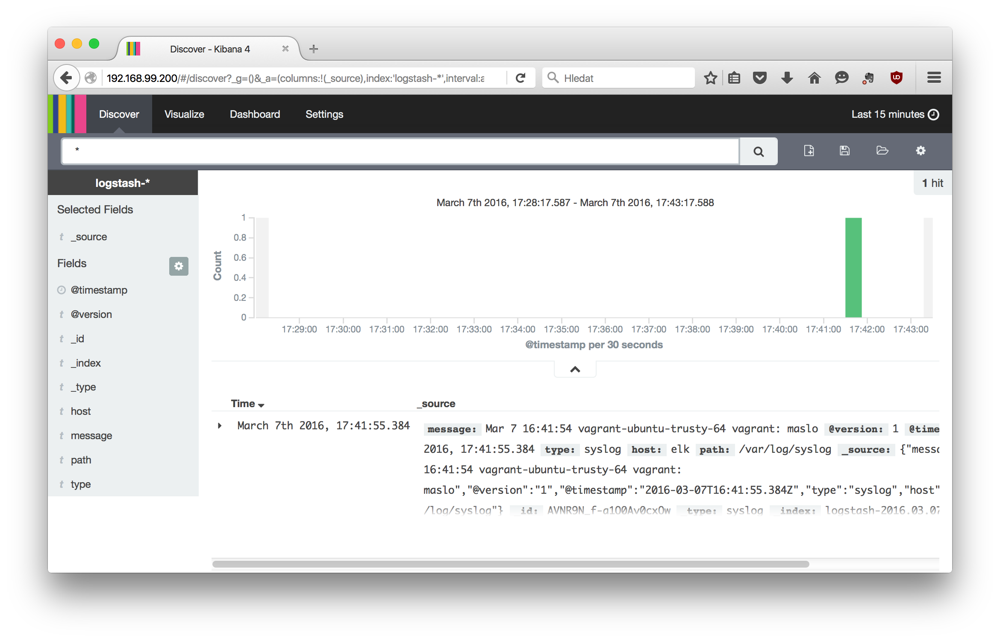

Follow instructions to create demo ELK stack in your environment.

# Install

For easier setup, I prepared [`Vagrantfile`](Vagrantfile) (description of virtual machine) and
[Ansible playbook](elk.yml) (complete recipe for installing ELK stack on machine). You
will need [Vagrant](https://www.vagrantup.com/) and
[Ansible](https://www.ansible.com/) version 1.7.1. installed on your machine.

Then launch this two commands:

    $ vagrant up                  # you will be asked for root password due to folder sharing
    $ ansible-playbook elk.yml

When they finish, you will have prepared Vagrant ELK machine. 
Default Logstash configuration watching just `/var/log/syslog` file
(further variants are described bellow in [Modifications
section](#modifications)).

If your initial situation is different (for example, you want to run playbook 
against your own server), take look at [Configuration section](#configuration) 
below.

# Demo

After succesfull installation, open your web browser and put there 
`http://192.168.99.200` URL. Enter credentials (`demo`/`demo`, if you not changed
[relevant variables](elk.yml#L30-L31)).

Once you log in, you will see settings page asking you for selecting
index pattern. Select `@timestamp` value in *Time-field name* field and click
on *Create* button.

If you now click on *Discover* item menu, you will see your first message in
Kibana. Congratulation!

# Configuration

If you want run Ansible playbook agains different target than Vagrant box,
you must setup SSH access and update several variables. 

In [`hosts.ini`](hosts.ini) file is stored IP address of your target machine. Update it
according to your situation (on both lines).

In [`ansible.cfg`](ansible.cfg) file:

* `remote_user` -- username for SSH access
* `private_key_file` -- path to your private SSH key

In [`elk.yml`](elk.yml) file:

* `logger_kibana_auth_username`, `logger_kibana_auth_password` -- credentials
  for HTTP Basic Authorization to Kibana web interface

For further details, see official 
[Ansible documentation](http://docs.ansible.com/ansible/intro_configuration.html) 
please.

# Modifications

During my [talk](../talk) I tweak configuration of Logstash several times to
gradually present key features.

You will find those modification scripts in `/configs` directory inside VirtualBox
machine. Just log in with `vagrant ssh` command, go into `/configs` folder and run as `root`
user this scripts:

* [`01_access_kibana_file.sh`](configs/01_access_kibana_file.sh)  
  Change `input` section of `/etc/logstash/conf.d/logstash.conf` file. From now
  it will consume not only `/etc/log/syslog` file, but also
  `/var/log/nginx/kibana.log`.  To be precise, script also change things around
  user/group acccess to Kibana log file.
* [`02_nginx_filter.sh`](configs/02_nginx_filter.sh)  
  Section `filter` in `/etc/logstash/conf.d/logstash.conf` now contains rules
  for parsing Nginx log. After you run this script, you must go into Settings
  section in Kibana and update index (click on orange buttons with "recycle" arrows). Then you will see rich set of Nginx
  attributes on Discovery section.
* [`03_nginx_demosite.sh`](configs/03_nginx_demosite.sh)  
  Whole new Nginx configuration will be added into machine. It will serve simple
  static web site. Logstash configuration will be modified too, we need to 
  observe new access log and make small modification in filter section.  
  Then you must run script [`03_traffic.sh`](configs/03_traffic.sh). It will invoke [`traffic.py`](configs/traffic.py) script,
  which will emulate traffic on our small static site. See documentation in this
  file for further information.
* [`04_extension.sh`](configs/04_extension.sh)  
  Last modification which wasn't covered in talk. It add new
  rules for Logstash, so data from Nginx will contain new attribute `extension`
  representing requested file extension. I want demonstrate some subaggregation
  visualisations with this.
